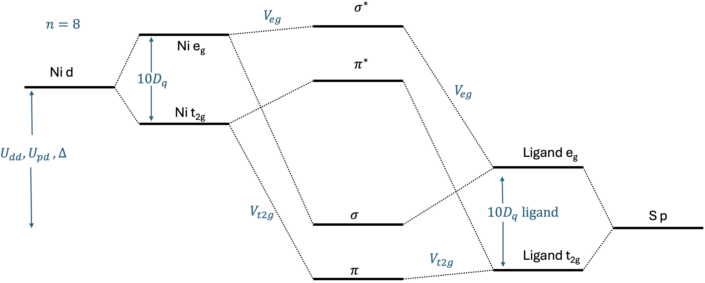

---
jupytext:
  text_representation:
    extension: .md
    format_name: myst
    format_version: 0.13
    jupytext_version: 1.17.2
kernelspec:
  display_name: Python 3 (ipykernel)
  language: python
  name: python3
---

# RIXS calculations for an Anderson Impurity Model
An Anderson Impurity Model (AIM) refers to a Hamiltonian with a set of correlated orbitals, often called the impurity or metal states, that hybridize with a set of uncorrelated orbitals, often called the ligands or bath states. 

This example examines RIXS simulations for NiPS₃ based on Ref. [^1]. The code used can be seen in `helper_function.py` when running the example. A more detailed description of AIMs in EDRIXS is available [here](https://edrixs.github.io/edrixs/auto_examples/example_3_AIM_XAS.html#sphx-glr-auto-examples-example-3-aim-xas-py).



The function we will run can be examined [here](https://github.com/EDRIXS/RIXSREXS2025-tutorial/blob/main/tutorials/AIM/helper_function.py). In this example, we will focus on some properties of the model.

```{code-cell} ipython3
:tags: [remove_output]

import numpy as np
import matplotlib.pyplot as plt
from helper_function import make_rixs

%matplotlib inline
```

```{code-cell} ipython3
:tags: [remove_input, remove_output]

# Secretly make figures look nice!
plt.rcParams.update({'figure.dpi': 150, 'savefig.dpi': 150,
                     'font.size': 8})
```

## Original model

```{code-cell} ipython3
---
tags: [remove_output]
jupyter:
  outputs_hidden: true
---
ominc, eloss, rixs, impurity_occupation = make_rixs()
```

```{code-cell} ipython3
:tags: [hide-output]

fig, ax = plt.subplots(figsize=(3, 4))
art = ax.pcolormesh(ominc, eloss, rixs.sum(-1).T, cmap='terrain', shading='gouraud',
                   vmin=0, vmax=1.5)
plt.colorbar(art, ax=ax, orientation='horizontal')
ax.set_xlabel('Incident energy (eV)')
ax.set_ylabel('Energy loss (eV)')
ax.set_title(f"{impurity_occupation:.1f} electrons on Ni")
plt.tight_layout()
plt.show()
```

## Magnetic field behavior
What is the spin of the ground state? And what will happen when a magnetic field is applied?

```{code-cell} ipython3
:tags: [remove_output]

ominc, eloss, rixs, impurity_occupation = make_rixs(ext_B=np.array([0.1, 0, 0]))
```

```{code-cell} ipython3
:tags: [hide-output]

fig, ax = plt.subplots(figsize=(3, 4))
art = ax.pcolormesh(ominc, eloss, rixs.sum(-1).T, cmap='terrain', shading='gouraud',
                   vmin=0, vmax=0.5)
plt.colorbar(art, ax=ax, orientation='horizontal')
ax.set_xlabel('Incident energy (eV)')
ax.set_ylabel('Energy loss (eV)')
ax.set_title(f"{impurity_occupation:.1f} electrons on Ni")
ax.set_ylim(-0.1, 0.5)
plt.tight_layout()
plt.show()
```

## Charge-transfer energy behavior
What happens to the charge on Ni and the spin-flip transition energy when the charge transfer energy is made very large?

```{code-cell} ipython3
---
tags: [remove_output]
jupyter:
  outputs_hidden: true
---
ominc, eloss, rixs, impurity_occupation = make_rixs(ext_B=np.array([0.1, 0, 0]),
                                                    Delta=10, c_level=-696)
```

```{code-cell} ipython3
:tags: [hide-output]

fig, ax = plt.subplots(figsize=(3, 4))
art = ax.pcolormesh(ominc, eloss, rixs.sum(-1).T, cmap='terrain', shading='gouraud',
                   vmin=0, vmax=0.5)
plt.colorbar(art, ax=ax, orientation='horizontal')
ax.set_xlabel('Incident energy (eV)')
ax.set_ylabel('Energy loss (eV)')
ax.set_title(f"{impurity_occupation:.1f} electrons on Ni")
ax.set_ylim(-0.1, 0.5)
plt.tight_layout()
plt.show()
```

[^1]: Wei He et al.,
       [Nature Communications 15, 3496 (2024)](https://doi.org/10.1038/s41467-024-47852-x).
