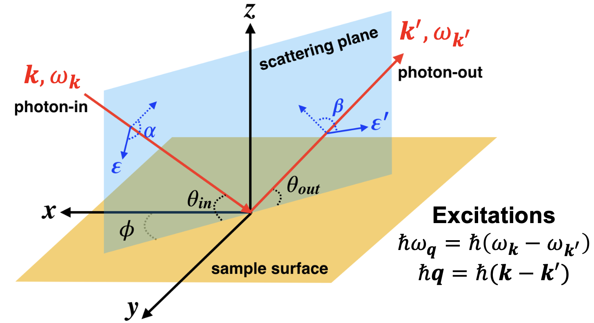

# Introductory material

[EDRIXS](https://edrixs.github.io/edrixs/) is an open-source toolkit for performing exact diagonalization RIXS calculations. See Ref. [^1] for the original paper, Ref. [^2] for the docs, and Ref. [^3] for the source code.  

## Geometry and notation

Consider a typical setup for RIXS.

Here, RIXS intensity is described by  [^4]

$$
I \propto \frac{1}{\mathcal{Z}(T)}\sum_{i}e^{- E_{i}/(k_\mathrm{B}T)} \\
\times \sum_f |M_{fi}|^2 \delta(E_f + \hbar\omega_{\boldsymbol{k}^\prime} - E_i - \hbar\omega_{\boldsymbol{k}} )
$$

where $\mathcal{Z}(T) = \sum_i e^{- E_i/(k_\mathrm{B}T)}$ is the partition function. The main part of the physics is in the matrix elements $M_{fi}$, which can be illustrated as 

and calculated via

$$
M_{fi} = \sum_n \frac{\bra{f} {\cal D}^\dagger_{\boldsymbol{k}^\prime\hat{\epsilon}^\prime}\ket{n}\bra{n} {\cal D}^{\phantom\dagger}_{\boldsymbol{k}\hat{\epsilon}}\ket{i}}{E_n - E_i - \hbar\omega_{\boldsymbol{k}}+\mathrm{i}\Gamma_n/2}.
$$

## Hamiltonian

Adopting the second quantization formalism, Hamiltonians $\hat{H}$ in EDRIXS take the general form

$$
\hat{H} = \sum_{\alpha\beta}t_{\alpha\beta}\hat{f}_{\alpha}^{\dagger}\hat{f}^{\phantom\dagger}_{\beta}+\sum_{\alpha\beta\gamma\delta}U_{\alpha\beta\gamma\delta}\hat{f}_{\alpha}^{\dagger}\hat{f}_{\beta}^{\dagger}\hat{f}^{\phantom\dagger}_{\delta}\hat{f}^{\phantom\dagger}_{\gamma}, \label{eq:secondQ}
$$

where the indices run through atomic valence and core orbitals and $\hat{f}_{\alpha}^{\dagger}$
creates an electron in spin-orbital $\alpha$. 

The two fermion term $t_{\alpha\beta}$, called ``emat`` in the code, accounts for:

* Crystal field
* Spin orbit coupling
* Hopping (in cases where this is part of the model)

The four fermion term, called ``umat`` in the code, includes:

* Intra Valence shell Coulomb interactions e.g. Slater integrals $F^0_{dd,i}$, $F^2_{dd,i}$, and $F^4_{dd,i}$ for a $d$ shell. 
* Core-valence Coulomb interactions e.g. Slater integrals $G^1_{dp}$ and $G^3_{dp}$.

## Basis
By default, EDRIXS will work in the complex harmonic basis $Y^m_l$ where $m$ goes from $-l,-l+1,...,l-1, l$. There is an up spin and a down spin for each $Y^m_l$. On occation we will also use the real harmonic basis $d_{3z^2-r^2}, d_{xz}, d_{yz}, d_{x^2-y^2}, d_{xy}$. EDRIXS can straightfowardly translate between these notations.

[^1]: EDRIXS: An open source toolkit for simulating spectra of resonant inelastic x-ray scattering, YL Wang, G Fabbris, MPM Dean, and G Kotliar, [Computer Physics Communications 243, 151–165 (2019)](https://doi.org/10.1016/j.cpc.2019.04.018)

[^2]: [EDRIXS website](https://edrixs.github.io/edrixs/)

[^3]: [EDRIXS github](https://github.com/EDRIXS/edrixs)

[^4]: Exploring Quantum Materials with Resonant Inelastic X-Ray Scattering, M. Mitrano, S. Johnston, Young-June Kim, and M. P. M. Dean
      [Phys. Rev. X 14, 040501 (2024)](https://doi.org/10.1103/PhysRevX.14.040501).
